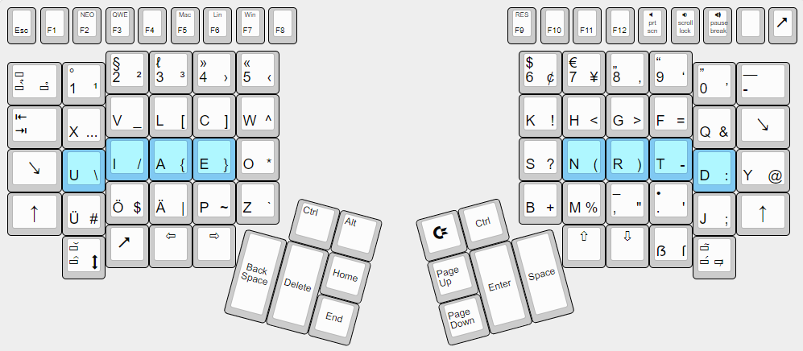

# Kinesis Neolike

This keyboard behaves like the Kinesis default layout (with minor bugfixes), but it has a keypad layer like the original firmware. With progm-F9, the function labeled RESET, the bootloader can be activated.

But here comes the specialty of this layout: In emulates the [Neo2](https://neo-layout.org/)-layout inside the keyboard! To switch to Neo mode, press progm-F2. To switch back to QWERTY, press progm-F3. The layout in Neo mode looks like this:

The layout uses scancodes when possible, Unicode when neccesary. You need to configure as follows:

System | Combination to enable | Keyboard layout to be selected in the OS
--- | --- | ---
macOS | progm-F5 (labelled mac) | Unicode Hex Input
IBus enabled systems | progm-F6 (labelled pc) | US International with all the dead keys
Windows | progm-F7 (labelled win) | US International (you also have to have [WinCompose](https://github.com/samhocevar/wincompose) running)

Currently, the Neo mode emulates the first 3 layers of the Neo2 layout. More will follow.